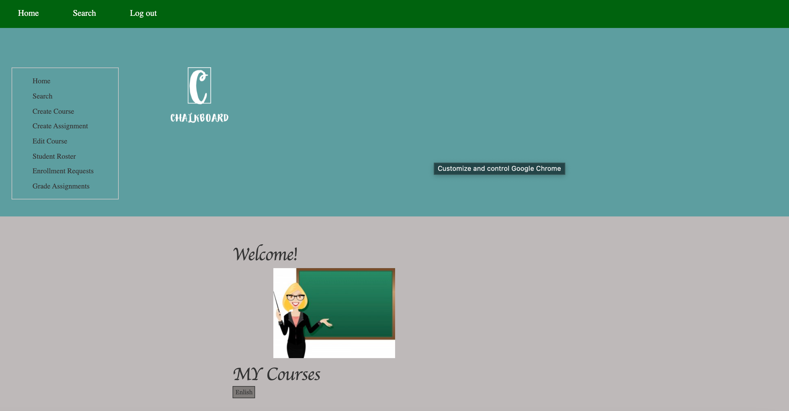

# Link to our actual website: https://ibnat136.github.io/chalkboard/
## Miss Prity Khatun

I have learned how to design wireframe and sitemap, before building any website it is important to layout the design first in this way you will know exactly how you want your webpage to look like. Also I have learned how to collaboratively work togeher using GitHub. My partner and I both disgussed how we want our chalkboard to look like and the specific parts for each student and instructor even for the admin. I have designed the wireframe for the students and the insructor and the admin. 

Deliverable 1: 

Ibnat and I are both equal contributors and we divided our work, I worked on the student's chalkboard page and the admin page. Since D1 was about HTML I have created basic web pages for Student view, course info, submission page, class work and Admin view, where I have made all the pages responsive and added buttons, inputs and etc.

Deliverable 2:

In this deliverable we fixed whatever issues we had that our teacher pointed to us. Where one of the issue was that the pages were not connected to each other. I worked on the student's view so, I connected all the pages that where supposed to relate to the student view such as class view for student and also added the related pages for class such as  student work submission page. Also I have connected the instructor's view and the student's view into admin so the admin can view all the details of what the instructor or the student are doing with chalkboard. 

Deliverable 3:

For this deliverable I have worked on the user authentication. First I tried with passport and then I have done the authentication using node.js and MongoDB and I was successfully able to connect to the database. 

For the final part, I fixed user authentication and sessions, and fixed few loose ends.

## Ibnat Nuha 
I learned how to create sitemap and wireframe.By doing this I learned how important it is to have a visualization before we create our website, I have never drawn any wire frame before so the video helped me a lot to prepare for this assignment. I have also learned how to use markup in Read.me file. I have created site map for this assignment and part of the wire frame where I layout out the idea for home page of the website.

Me and my team mate both equally distrubuted our work. We divided the html portion of our webpage where I created the welcome page and all component for instructor pages such as Instructor home page, each course page and a submission page where the instructor can see the submission of each student. I have also created a siign up page for the users who doesn't have an account. Below are some screenshots of my created webpages.

In the wireframe there were some features that we were mising such as leave option for instructor. In the wereframe we didn't show the instructor can leave course by themselves or another instructor can remove an instructor. We also changed some of the design aspect. 

For delivarable 2 me and my team mate add more responsiveness with css and also we used bootstrap. I also made sure that all the pages are linked and every button is showing it's purpose on the page. This delivarable helped to learn more about bootstrap. For delivarable 2 we used visual studio.

For delivarable 3 I have created the database made sure that everything is working properly with this database. 
I have also try to deploy the website hoever in the beginning I facing some issue with it however after debugging a lot we finally figure out the error and it ran successfully. I ahve also took the 
feedback from previous delivarable and fix the changes according to that such fixed some of the responsiveness and added some of the missing 
requirements of the delivarable. I have also added some ejs code to admin page to bring 

For the final project I did connected other loose ends connected everythign with the database. Instructor and Students page are connected with database. 

### Welcome/ Login Page View

### Sign up Page

### Student View

### Student Course View

### Student Class Work View

### Student Search Page

### Available Course

### Admin View

### Admin View 

### Instructor Home Page

### Create Course Page for Instructor

### Create Assignment Page for Instructor

### Edit Course

### Student Roster

### Student Enroll Request

### Student Grade

